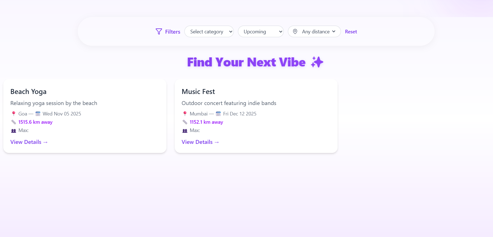
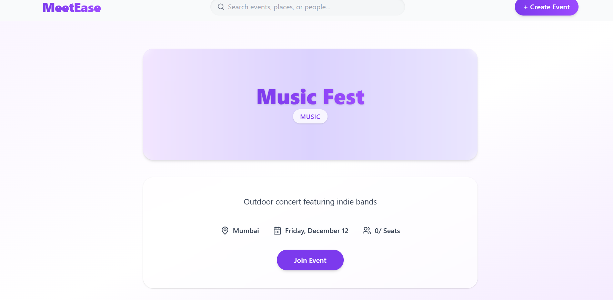
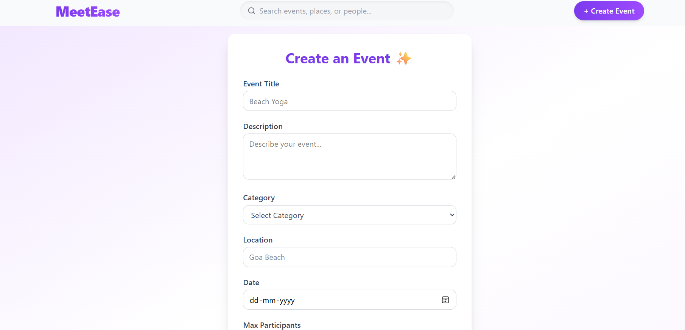

#  MeetEase – Event Management App

MeetEase is a modern event management platform built with **React (Vite)** and **Express + TypeScript**.  
Users can browse, filter, and join events easily — with real-time updates and a clean UI.

---

##  Features
-  Filter events by **category**, **date**, and **distance**
-  View detailed event pages
-  Join events (with participant limits)
-  Toast notifications for actions
-  Backend API using **Express & TypeScript**
-  Frontend powered by **React + Tailwind CSS**

---

##  Tech Stack

**Frontend:**  
- React + Vite  
- Tailwind CSS  
- Axios  
- React Router  
- React Hot Toast  

**Backend:**  
- Node.js  
- Express.js  
- TypeScript  

---

**Preview**
- HOME

- EVENTS

- EVENT DETAILS

- CREATE EVENTS

**Frontend**
cd frontend
npm install

**Backend**
cd backend
npm install

🔹 **Run the App**
**Start Backend**
cd backend
npm run dev

**Start Frontend**
cd frontend
npm run dev

**AI Tools Used**
Tool	Usage
 ChatGPT (MystAI)	Helped in structuring backend logic, improving UI with Tailwind, and debugging.
 GitHub Copilot	Assisted with repetitive TypeScript typings and auto-completions.

**API Documentation**
🔹 GET /api/events

Fetch all available events.

🔹 GET /api/events/:id

Fetch single event details.

🔹 POST /api/events

**Backend (.env)**
- PORT=4000

**Frontend (.env)**
- VITE_API_BASE_URL=http://localhost:4000